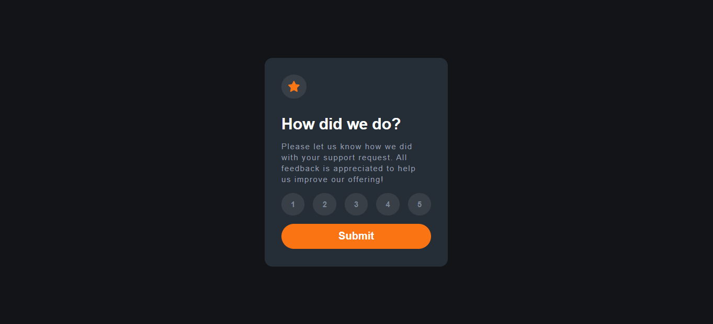
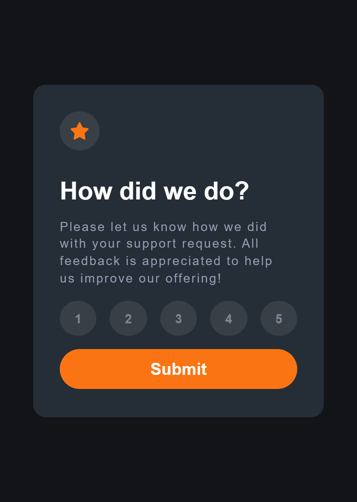

# Frontend Mentor - Interactive rating component solution

This is a solution to the [Interactive rating component challenge on Frontend Mentor](https://www.frontendmentor.io/challenges/interactive-rating-component-koxpeBUmI). Frontend Mentor challenges help you improve your coding skills by building realistic projects. 

## Table of contents

- [Overview](#overview)
  - [The challenge](#the-challenge)
  - [Screenshot](#screenshot)
  - [Links](#links)
- [My process](#my-process)
  - [Built with](#built-with)
  - [What I learned](#what-i-learned)
  - [Continued development](#continued-development)
  - [Useful resources](#useful-resources)
- [Author](#author)
- [Acknowledgments](#acknowledgments)

**Note: Delete this note and update the table of contents based on what sections you keep.**

## Overview
This is an interactive Rating Card Component built with react, for the front-end mentor design challenge

### The challenge

Users should be able to:

- View the optimal layout for the app depending on their device's screen size
- See hover states for all interactive elements on the page
- Select and submit a number rating
- See the "Thank you" card state after submitting a rating

### Screenshot

Desktop 


Mobile 


### Links

- Repository: [Github](https://rating-component-react-fr.netlify.app/)
- [Live Site](https://rating-component-react-fr.netlify.app/)

## My process
For this project, I took about 12 hours. I built it out entirely using React.

### Built with

- Semantic HTML5 markup
- CSS custom properties
- Flexbox
- CSS Grid
- Mobile-first workflow
- [React](https://reactjs.org/) - JS library

### What I learned

- I have learned how to work wih props and states in React

- I have learned how to pass down props fom parent components to child components
```jsx
<div className="App">
  <Container rating={this.setRating} submitStatus={this.submit} getRateValue={this.getRating}/>
</div>
```
- I have learned how to change the state of a parent component, from the Child Component

- I have learned conditional rendering. Only rendering a given component under a certaing condition
```jsx
render()
  {
    if (this.state.submit === false)
    {
      return(
        <div className="App">
          <Container rating={this.setRating} submitStatus={this.submit} getRateValue={this.getRating}/>
        </div>
      );
    }
    else
    {
      return(
        <div className="App">
          <Success getRateValue={this.getRating}/>
        </div>
      );
    }
  }
```

### Continued development

React is a very powerful UI library. I want to continue practising working with states, and props in React

### Useful resources

- [React Docs](https://reactjs.org/docs/getting-started.html) - This is the official documentation page for React. It helped mere learn about, how to pass additional argument to eventhandlers, and how to render components conditionally.


## Author

- Frontend Mentor - [@munyite001](https://www.frontendmentor.io/profile/yourusername)
- Twitter - [@emunyite](https://www.twitter.com/emunyite)
- Github - [munyite001](https://www.github.com/munyite001)